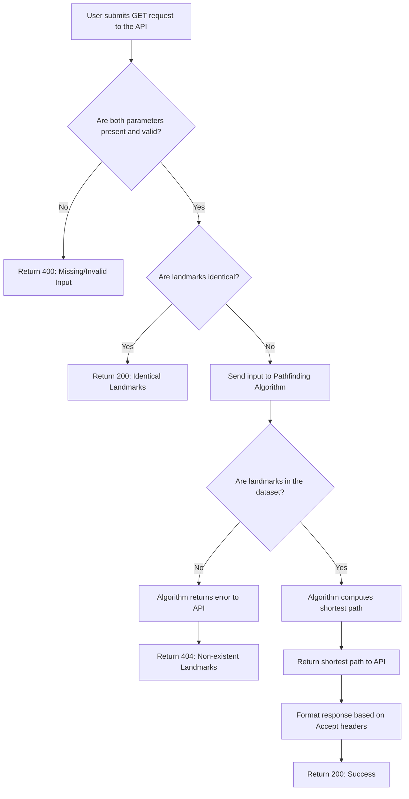

# Functional Specifications

<details>
<summary>Table of Contents</summary>

- [Functional Specifications](#functional-specifications)
  - [1. Introduction](#1-introduction)
    - [1.1. Glossary](#11-glossary)
    - [1.2. Project Overview](#12-project-overview)
    - [1.3. Project Definition](#13-project-definition)
      - [1.3.1. Vision](#131-vision)
      - [1.3.2. Objectives](#132-objectives)
      - [1.3.3. Scope](#133-scope)
      - [1.3.4. Target Audience](#134-target-audience)
      - [1.3.5. Deliverables](#135-deliverables)
    - [1.4. Project Organization](#14-project-organization)
      - [1.4.1. Project Representatives](#141-project-representatives)
      - [1.4.2. Stakeholders](#142-stakeholders)
      - [1.4.3. Project Roles](#143-project-roles)
      - [1.4.4. Project Reviewers](#144-project-reviewers)
    - [1.4. Project Plan](#14-project-plan)
      - [1.4.1. Planning](#141-planning)
      - [1.4.2. Milestones](#142-milestones)
      - [1.4.3. Dependencies](#143-dependencies)
      - [1.4.4. Assumptions/Constraints](#144-assumptionsconstraints)
      - [1.4.5. Risks/Mitigation](#145-risksmitigation)
  - [2. Personas and Use Cases](#2-personas-and-use-cases)
    - [2.1. Personas](#21-personas)
      - [2.1.1. Alex](#211-alex)
      - [2.1.2. Emily](#212-emily)
      - [2.1.3. Dr. Nair](#213-dr-nair)
    - [2.2. Use Cases](#22-use-cases)
  - [3. Functional Requirements](#3-functional-requirements)
    - [3.1. REST API Implementation](#31-rest-api-implementation)
      - [3.1.1. Route Description](#311-route-description)
      - [3.1.2. Reponse codes](#312-reponse-codes)
      - [3.1.3. Request Examples](#313-request-examples)
      - [3.1.4. Response examples](#314-response-examples)
    - [3.2. Data Verification Tool](#32-data-verification-tool)
      - [3.2.1. Features](#321-features)
      - [3.2.3. Error Reporting](#323-error-reporting)
      - [3.2.4. Output](#324-output)
    - [3.3. Pathfinding Algorithm](#33-pathfinding-algorithm)
      - [3.3.1. Input](#331-input)
      - [3.3.2. Output](#332-output)
      - [3.3.3. REST API Integration](#333-rest-api-integration)
    - [3.4. Program Flow](#34-program-flow)
  - [4. Non-functional Requirements](#4-non-functional-requirements)
    - [4.1. Performance](#41-performance)
    - [4.2. Scalability](#42-scalability)
    - [4.3. Usability](#43-usability)
    - [4.4. Data Integrity](#44-data-integrity)
    - [4.5. Reliability](#45-reliability)
    - [4.6. Maintainability](#46-maintainability)
    - [4.7. Compliance](#47-compliance)

</details>

## 1. Introduction

### 1.1. Glossary

| Term       | Definition                                                                                                                          |
| ---------- | ----------------------------------------------------------------------------------------------------------------------------------- |
| REST API   | A web service architecture that uses HTTP requests to provide access to resources or perform actions.                               |
| HTTP       | Abbreviation for hypertext transfer protocol: A standard application-level protocol used for exchanging files on the World Wide Web |
| Heuristics | Techniques that find approximate solutions to complex problems more quickly than traditional methods.                               |
| MVP        | Minimum Viable Product, the simplest version of a product that can be released to gather user feedback.                             |

### 1.2. Project Overview

This project aims to create a software solution that calculates the quickest path between two landmarks in the United States.

### 1.3. Project Definition

#### 1.3.1. Vision

The vision of our algorithm is to provide a fast, reliable approximation of the shortest path duration between two points in the United States, with the potential to expand globally and integrate with mapping services.

#### 1.3.2. Objectives

- **REST API with single endpoint:** The software exposes its functionality through a XML and JSON REST API running on an HTTP server with a unique GET endpoint for requests.
- **Response Time:** All queries to the API should be handled in less than 1 second on a typical laptop.
- **Approximation Heuristics:** The returned path should not exceed the shortest path duration by more than 10% when prioritizing speed over precision.

#### 1.3.3. Scope

This software will be developed using C++, a high-performance language that allows fast processing of data. The program will also include an HTTP server running a REST API in XML and JSON format with a single GET endpoint.

#### 1.3.4. Target Audience

The target audience includes:
- Logistics companies seeking efficient routing solutions.
- Developers of navigation applications.
- Researchers in transportation optimization looking for new algorithms.

#### 1.3.5. Deliverables

| Deliverable               | Purpose                                                                                                                                                |
| ------------------------- | ------------------------------------------------------------------------------------------------------------------------------------------------------ |
| Functional Specifications | Detailled documentation of the features used and their non-technical aspects.                                                                          |
| Technical Specifications  | Detailled  documentation about the technical implementation of software                                                                                |
| Data Validation Tool      | A utility to verify the integrity of the provided CSV file.                                                                                            |
| C++ Source Code           | The source code of the software program, including the shortest path algorithm and the HTTP server.                                                    |
| Test Suite                | Tests to validate correctness, performance, and compliance with the 10% approximation rule.                                                            |
| Test Plan & Test Cases    | A set of scenarios validating the algorithm's performance and accuracy with a strategy to run test suite tests in the most accurate and efficient way. |
| User Manual               | The end-user documentation for the software.                                                                                                           |

### 1.4. Project Organization

#### 1.4.1. Project Representatives

| Full Name             | Occupation        | Links                                                                   |
| --------------------- | ----------------- | ----------------------------------------------------------------------- |
| Victor LEROY          | Project manager   | [LinkedIn](https://www.linkedin.com/in/victor-leroy-64baa3229/)         |
| Antoine PREVOST       | Program manager   | [LinkedIn](https://www.linkedin.com/in/antoine-prevost-dev/)            |
| David CUAHONTE CUEVAS | Tech lead         | [LinkedIn](https://www.linkedin.com/in/david-cuahonte-527781221/)       |
| Thomas PLANCHARD      | Software engineer | [LinkedIn](https://www.linkedin.com/in/thomas-planchard-461782221/)     |
| Mathis KAKAL          | Software engineer | [LinkedIn](https://www.linkedin.com/in/mathis-k-a239ba10a/)             |
| Max BERNARD           | Quality assurance | [LinkedIn](https://www.linkedin.com/in/max-bernard-b77680210/)          |
| Quentin CLEMENT       | Technical writer  | [LinkedIn](https://www.linkedin.com/in/quentin-cl%C3%A9ment-939110221/) |

#### 1.4.2. Stakeholders

| Role            | Representative | Expectations                                                           |
| --------------- | -------------- | ---------------------------------------------------------------------- |
| Client          | Franck JEANNIN | Finished project meeting requirements                                  |
| School director | Franck JEANNIN | Clear documentation and management based on the skills learnt in class |

#### 1.4.3. Project Roles

| Role              | Description                                                                                                                                                          | Name                             |
| ----------------- | -------------------------------------------------------------------------------------------------------------------------------------------------------------------- | -------------------------------- |
| Project Manager   | Responsible for the overall planning, execution, and success of the project.                                                                                         | Victor LEROY                     |
| Program Manager   | Makes sure the project meets expectation. <br> Is in charge of design. Is responsible for writing the Functional Specifications                                      | Antoine PREVOST                  |
| Tech Lead         | Makes the technical decision in the project. <br> Translates the Functional Specification into Technical Specifications. <br> Does code review.                      | David CUAHONTE CUEVAS            |
| Software Engineer | Writes the code. <br> Writes documentation. <br> Participate in the technical design.                                                                                | Thomas PLANCHARD<br>Mathis KAKAL |
| Quality Assurance | Tests all the functionalities of a product to find bugs and issues. <br> Document bugs and issues. <br> Write the test plan. <br> Check that issues have been fixed. | Max BERNARD                      |
| Technical Writer  | Responsible for creating and maintaining the project's documentation.                                                                                                | Quentin CLEMENT                  |

#### 1.4.4. Project Reviewers

External project reviewers have been appointed by the project owner to review our specifications and provide us with feedback.

### 1.4. Project Plan

#### 1.4.1. Planning

Planning will follow an iterative approach, with each iteration focused on specific functionality, testing, and validation to ensure quality and performance.

#### 1.4.2. Milestones

| Date | Milestone |
| ---- | --------- |
|      |           |

#### 1.4.3. Dependencies

- MVP development cannot start before the data integrity of the provided dataset is verified.
- An iteration on the project cannot start before tests are run on the current version.
- A release of the project cannot occur before all tests of the current version are successful.

#### 1.4.4. Assumptions/Constraints

**Assumptions:**  

| Assumption             | Description                                                                            |
| ---------------------- | -------------------------------------------------------------------------------------- |
| Data Consistency       | Input data will conform to expected formats, types, and logical constraints.           |
| Non-concurrent Queries | API will be accessed by a single user without doing concurrent queries during testing. |
| Endpoint Accessibility | The API endpoint is reachable from authorized clients.                                 |

**Constraints:**  

| Constraint         | Description                                                                         |
| ------------------ | ----------------------------------------------------------------------------------- |
| Compatibility      | The software must run on widely-used operating systems (e.g., Windows, macOS).      |
| Dataset Size       | The dataset must not exceed the program's memory capacity on a typical laptop.      |
| Network Dependency | The API must function over standard HTTP protocols without advanced configurations. |

#### 1.4.5. Risks/Mitigation

| ID  | Description                         | Consequence                                 | Impact | Likelihood | Mitigation                                                      |
| --- | ----------------------------------- | ------------------------------------------- | ------ | ---------- | --------------------------------------------------------------- |
| R01 | Dataset errors or gaps              | Incorrect route calculation                 | High   | Medium     | Validate datasets.                                              |
| R02 | API performance issues              | Delayed response times                      | High   | High       | Optimize algorithm.                                             |
| R03 | Inconsistent input validation       | API errors or unexpected behavior           | Medium | Medium     | Implement strict input validation and testing.                  |
| R04 | Hardware limitations                | Unable to meet performance requirements     | High   | Low        | Optimize resource usage and test on target hardware.            |
| R05 | Memory overflow with large datasets | Crashes or unresponsiveness                 | High   | Low        | Use efficient data structures and memory management.            |
| R06 | Incorrect heuristic implementation  | Results deviate significantly from expected | Medium | Low        | Test heuristics extensively and validate against known results. |

Let me know if you'd like me to integrate this expanded list into your document!

## 2. Personas and Use Cases

### 2.1. Personas

#### 2.1.1. Alex


#### 2.1.2. Emily


#### 2.1.3. Dr. Nair


### 2.2. Use Cases

| Use Case                            | Description                                                                                                       |
| ----------------------------------- | ----------------------------------------------------------------------------------------------------------------- |
| Route Calculation                   | Users provide two landmark IDs, and the API returns the fastest route between them for transportation purposes.   |
| API Integration                     | Developers integrate the API into applications to enable real-time routing between two landmarks using their IDs. |
| Transportation Engineering Research | Supports transportation engineering research by providing relevant data and actionable insights.                  |

## 3. Functional Requirements

### 3.1. REST API Implementation

> [!IMPORTANT]  
> Example host URLs in this section use the IP address `127.0.0.1` for demonstration and general understanding purposes. When testing the API from a remote device, replace `127.0.0.1` with the correct host address.

#### 3.1.1. Route Description

- **URL:** `http://127.0.0.1:8080/quickest_path`
- **Method:** `GET`
- **Headers:**
  - `Content-Type`: `application/json`
  - `Accept`: `application/json` or `application/xml`

- **Query Parameters:**

| Parameter Name | Type    | Expected value               |
| -------------- | ------- | ---------------------------- |
| landmark_1     | integer | Value between 1 and 23947347 |
| landmark_2     | integer | Value between 1 and 23947347 |

#### 3.1.2. Reponse codes

| Case                      | HTTP Code | Description                                                              | Example JSON Response                                                                                                   | Example XML response |
| ------------------------- | --------- | ------------------------------------------------------------------------ | ----------------------------------------------------------------------------------------------------------------------- | -------------------- |
| Valid request             | 200       | Successfully returns the quickest path.                                  | `{ "time": 66, "steps": [ { "landmark": 322, "distance": 33 }, { "landmark": 323, "distance": 33 } ] }`                 |                      |
| Identical landmarks       | 200       | Returns response with `time` as `0` and empty steps.                     | `{ "time": 0, "steps": [] }`                                                                                            |                      |
| Missing or invalid inputs | 400       | Request does not include valid `landmark_1` and `landmark_2` parameters. | `{ "error": { "code": 400, "message": "Missing or invalid parameters: 'landmark_1' and 'landmark_2' are required." } }` |                      |
| Non-existent landmarks    | 404       | One or both landmarks are not found in the dataset.                      | `{ "error": { "code": 404, "message": "No path found between the specified landmarks." } }`                             |                      |

#### 3.1.3. Request Examples

> [!NOTE]  
> The values of parameters `landmark_1` and `landmark_2` are used for demonstration purpose only.

```http
GET /quickest_path?landmark_1=322&landmark_2=333 HTTP/1.1
Host: 127.0.0.1:8080
Accept: application/json
```

```http
GET /quickest_path?landmark_1=3455&landmark_2=745647 HTTP/1.1
Host: 127.0.0.1:8080
Accept: application/xml
```

#### 3.1.4. Response examples

You can find below a sample response the API could be returning. It contains various fields described in the following:

| Represented Entity      | JSON Property Name               | XML tag                 | Data Type (JSON) | Represented Element                                                                                                                                                                |
| ----------------------- | -------------------------------- | ----------------------- | ---------------- | ---------------------------------------------------------------------------------------------------------------------------------------------------------------------------------- |
| Total Time              | `"time"`                         | `<time></time>`         | Integer          | Total time between `landmark_1` and `landmark_2`                                                                                                                                   |
| Steps Description       | `"steps"`                        | `<steps></steps>`       | Array            | List of all the landmarks on the shortest path found                                                                                                                               |
| Step                    | `{ "landmark": , "distance":  }` | `<step></step>`         | Object           | Representation of a landmark on the shortest path found                                                                                                                            |
| Landmark                | `"landmark"`                     | `<landmark></landmark>` | Integer          | The ID of a step landmark on the path between `landmark_1` and `landmark_2`                                                                                                        |
| Time between two points | `"distance"`                     | `<distance></distance>` | Integer          | The time between the previous landmark and the ID of the one indicated in the current object (the first object contains the time between `landmark_1` and the current landmark ID) |


> [!NOTE]  
> The values contained in the following responses are not correct nor respresentative of the dataset and are used for demonstration purposes only.

**JSON Example Response:**

```json
{
  "time": 66,
  "steps": [
    { "landmark": 322, "distance": 33 },
    { "landmark": 323, "distance": 33 }
  ]
}
```

**XML Example Response:**

```xml
<response>
  <time>66</time>
  <steps>
    <step>
      <landmark>322</landmark>
      <distance>33</distance>
    </step>
    <step>
      <landmark>323</landmark>
      <distance>33</distance>
    </step>
  </steps>
</response>
```

### 3.2. Data Verification Tool

The data verification tool ensures the integrity and usability of the `USA-roads.csv` dataset. It performs the following checks and validations:

#### 3.2.1. Features

| Feature                    | Description                                                                                               | Example error                                                                                    |
| -------------------------- | --------------------------------------------------------------------------------------------------------- | ------------------------------------------------------------------------------------------------ |
| Duplicate Connection Check | Identifies and flags any duplicate entries in the dataset to ensure unique connections between landmarks. | `Duplicate connection found: Landmark_A_ID=322, Landmark_B_ID=333.`                              |
| Graph Validation           | Ensures the dataset forms a valid graph structure without any cycles (Directed Acyclic Graph - DAG).      | `Cycle detected: Landmark_A_ID=100 -> Landmark_B_ID=200 -> Landmark_A_ID=100.`                   |
| Connectivity Check         | Verifies that the graph is fully connected, ensuring there are paths between all pairs of landmarks.      | `Disconnected subgraph found: Node group starting from Landmark_A_ID=500.`                       |
| Data format Validation     | Checks for malformed or invalid rows in the dataset.                                                      | `Invalid row format: Expected format 'Landmark_A_ID,Landmark_B_ID,Time'. Row: '322,invalid,33'.` |

#### 3.2.3. Error Reporting

- Generates a detailed log file summarizing all detected issues for developer review.
- Categorizes errors by type (e.g., duplicate connections, graph validation errors) for quick identification.

#### 3.2.4. Output

- A summary report indicating whether the dataset passed or failed validation.
- Suggestions for corrective actions, such as removing duplicates or fixing disconnected subgraphs.

### 3.3. Pathfinding Algorithm

#### 3.3.1. Input

To work correctly, the pathfinding algorithm needs the following input parameters:

| Input parameter  | Description                      |
| ---------------- | -------------------------------- |
| Source Node      | Identifier of the starting point |
| Destination Node | Identifier of the endpoint       |

#### 3.3.2. Output

- The algorithm returns:
  - **Path Details**: Ordered list of nodes representing the shortest path.
  - **Travel Time**: Estimated duration for the path.
  - **Error Codes**: In case of failure, error codes and diagnostic messages are returned.

- Example output format (JSON):
  ```json
  {
    "path": ["A", "B", "C"],
    "travel_time": 120
  }
  ```

#### 3.3.3. REST API Integration

- The algorithm is exposed as a service through a REST API.
  - **Input Handling**: The API formats user input into the algorithm's required structure.
  - **Response Handling**: The API translates the algorithm's output into user-friendly JSON/XML formats.
- 

### 3.4. Program Flow



## 4. Non-functional Requirements

### 4.1. Performance

   - The API must handle any single query within **1 second** on a typical laptop such as a MacBook Air M3.

### 4.2. Scalability

   - The system must be designed to accommodate future expansion to larger datasets containing more landmarks and connexions.

### 4.3. Usability

   - API responses must support both **JSON** and **XML** formats to meet diverse client requirements.
   - Clear API documentation to facilitate easy integration by developers.

### 4.4. Data Integrity

   - Include utilities for **graph validation** and **connectivity checks** to ensure dataset consistency before use.

### 4.5. Reliability

   - High availability of the service with proper error handling for invalid input or unexpected conditions.
   - Ensure fault tolerance in the presence of incomplete or incorrect dataset entries.

### 4.6. Maintainability

   - The codebase must follow best practices for readability and maintainability, with sufficient inline comments and comprehensive documentation.
   - Support for future updates to algorithms or dataset formats.

### 4.7. Compliance

   - Adherence to RESTful API standards for consistency in design and implementation.
