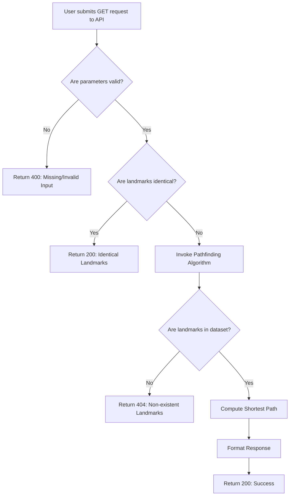

# Functional Specifications

<details>
<summary>Table of Contents</summary>

- [Functional Specifications](#functional-specifications)
  - [1. Introduction](#1-introduction)
    - [1.1. Glossary](#11-glossary)
    - [1.2. Project Overview](#12-project-overview)
    - [1.3. Project Definition](#13-project-definition)
      - [1.3.1. Vision](#131-vision)
      - [1.3.2. Objectives](#132-objectives)
      - [1.3.3. Scope](#133-scope)
      - [1.3.4. Target Audience](#134-target-audience)
      - [1.3.5. Deliverables](#135-deliverables)
    - [1.4. Project Organization](#14-project-organization)
      - [1.4.1. Project Representatives](#141-project-representatives)
      - [1.4.2. Stakeholders](#142-stakeholders)
      - [1.4.3. Project Roles](#143-project-roles)
      - [1.4.4. Project Reviewers](#144-project-reviewers)
    - [1.4. Project Plan](#14-project-plan)
      - [1.4.1. Planning](#141-planning)
      - [1.4.2. Milestones](#142-milestones)
      - [1.4.3. Dependencies](#143-dependencies)
      - [1.4.4. Assumptions/Constraints](#144-assumptionsconstraints)
      - [1.4.5. Risks/Mitigation](#145-risksmitigation)
  - [2. Personas and Use Cases](#2-personas-and-use-cases)
    - [2.1. Personas](#21-personas)
      - [2.1.1. Alex](#211-alex)
      - [2.1.2. Emily](#212-emily)
      - [2.1.3. Dr. Nair](#213-dr-nair)
    - [2.2. Use Cases](#22-use-cases)
  - [3. Functional Requirements](#3-functional-requirements)
    - [3.1. REST API Implementation](#31-rest-api-implementation)
      - [Overview](#overview)
      - [3.1.1. Endpoint Details](#311-endpoint-details)
      - [3.1.2. Response Codes](#312-response-codes)
      - [3.1.3. Request Examples](#313-request-examples)
      - [3.1.4. Response Examples](#314-response-examples)
    - [3.2. Data Verification Tool](#32-data-verification-tool)
      - [Overview](#overview-1)
      - [3.2.1. Key Features](#321-key-features)
      - [3.2.2. Output](#322-output)
    - [3.3. Pathfinding Algorithm](#33-pathfinding-algorithm)
      - [3.3.1. Overview](#331-overview)
      - [3.3.2. Input Parameters](#332-input-parameters)
      - [3.3.3. Output Details](#333-output-details)
      - [3.3.4. REST API Workflow](#334-rest-api-workflow)
    - [3.4. Program Flow](#34-program-flow)
  - [4. Non-functional Requirements](#4-non-functional-requirements)
    - [4.1. Performance](#41-performance)
    - [4.2. Scalability](#42-scalability)
    - [4.3. Usability](#43-usability)
    - [4.4. Data Integrity](#44-data-integrity)
    - [4.5. Reliability](#45-reliability)
    - [4.6. Maintainability](#46-maintainability)
    - [4.7. Compliance](#47-compliance)

</details>

## 1. Introduction

### 1.1. Glossary

| Term       | Definition                                                                                                                          |
| ---------- | ----------------------------------------------------------------------------------------------------------------------------------- |
| REST API   | A web service architecture that uses HTTP requests to provide access to resources or perform actions.                               |
| HTTP       | Abbreviation for hypertext transfer protocol: A standard application-level protocol used for exchanging files on the World Wide Web |
| Heuristics | Techniques that find approximate solutions to complex problems more quickly than traditional methods.                               |
| MVP        | Minimum Viable Product, the simplest version of a product that can be released to gather user feedback.                             |

### 1.2. Project Overview

This project aims to create a software solution that calculates the quickest path between two landmarks in the United States.

### 1.3. Project Definition

#### 1.3.1. Vision

The vision of our algorithm is to provide a fast, reliable approximation of the shortest path duration between two points in the United States, with the potential to expand globally and integrate with mapping services.

#### 1.3.2. Objectives

- **REST API with single endpoint:** The software exposes its functionality through a XML and JSON REST API running on an HTTP server with a unique GET endpoint for requests.
- **Response Time:** All queries to the API should be handled in less than 1 second on a typical laptop.
- **Approximation Heuristics:** The returned path should not exceed the shortest path duration by more than 10% when prioritizing speed over precision.

#### 1.3.3. Scope

This software will be developed using C++, a high-performance language that allows fast processing of data. The program will also include an HTTP server running a REST API in XML and JSON format with a single GET endpoint.

#### 1.3.4. Target Audience

The target audience includes:
- Logistics companies seeking efficient routing solutions.
- Developers of navigation applications.
- Researchers in transportation optimization looking for new algorithms.

#### 1.3.5. Deliverables

| Deliverable               | Purpose                                                                                                                                                |
| ------------------------- | ------------------------------------------------------------------------------------------------------------------------------------------------------ |
| Functional Specifications | Detailled documentation of the features used and their non-technical aspects.                                                                          |
| Technical Specifications  | Detailled  documentation about the technical implementation of software                                                                                |
| Data Validation Tool      | A utility to verify the integrity of the provided CSV file.                                                                                            |
| C++ Source Code           | The source code of the software program, including the shortest path algorithm and the HTTP server.                                                    |
| Test Suite                | Tests to validate correctness, performance, and compliance with the 10% approximation rule.                                                            |
| Test Plan & Test Cases    | A set of scenarios validating the algorithm's performance and accuracy with a strategy to run test suite tests in the most accurate and efficient way. |
| User Manual               | The end-user documentation for the software.                                                                                                           |

### 1.4. Project Organization

#### 1.4.1. Project Representatives

| Full Name             | Occupation        | Links                                                                   |
| --------------------- | ----------------- | ----------------------------------------------------------------------- |
| Victor LEROY          | Project manager   | [LinkedIn](https://www.linkedin.com/in/victor-leroy-64baa3229/)         |
| Antoine PREVOST       | Program manager   | [LinkedIn](https://www.linkedin.com/in/antoine-prevost-dev/)            |
| David CUAHONTE CUEVAS | Tech lead         | [LinkedIn](https://www.linkedin.com/in/david-cuahonte-527781221/)       |
| Thomas PLANCHARD      | Software engineer | [LinkedIn](https://www.linkedin.com/in/thomas-planchard-461782221/)     |
| Mathis KAKAL          | Software engineer | [LinkedIn](https://www.linkedin.com/in/mathis-k-a239ba10a/)             |
| Max BERNARD           | Quality assurance | [LinkedIn](https://www.linkedin.com/in/max-bernard-b77680210/)          |
| Quentin CLEMENT       | Technical writer  | [LinkedIn](https://www.linkedin.com/in/quentin-cl%C3%A9ment-939110221/) |

#### 1.4.2. Stakeholders

| Role            | Representative | Expectations                                                           |
| --------------- | -------------- | ---------------------------------------------------------------------- |
| Client          | Franck JEANNIN | Finished project meeting requirements                                  |
| School director | Franck JEANNIN | Clear documentation and management based on the skills learnt in class |

#### 1.4.3. Project Roles

| Role              | Description                                                                                                                                                          | Name                             |
| ----------------- | -------------------------------------------------------------------------------------------------------------------------------------------------------------------- | -------------------------------- |
| Project Manager   | Responsible for the overall planning, execution, and success of the project.                                                                                         | Victor LEROY                     |
| Program Manager   | Makes sure the project meets expectation. <br> Is in charge of design. Is responsible for writing the Functional Specifications                                      | Antoine PREVOST                  |
| Tech Lead         | Makes the technical decision in the project. <br> Translates the Functional Specification into Technical Specifications. <br> Does code review.                      | David CUAHONTE CUEVAS            |
| Software Engineer | Writes the code. <br> Writes documentation. <br> Participate in the technical design.                                                                                | Thomas PLANCHARD<br>Mathis KAKAL |
| Quality Assurance | Tests all the functionalities of a product to find bugs and issues. <br> Document bugs and issues. <br> Write the test plan. <br> Check that issues have been fixed. | Max BERNARD                      |
| Technical Writer  | Responsible for creating and maintaining the project's documentation.                                                                                                | Quentin CLEMENT                  |

#### 1.4.4. Project Reviewers

External project reviewers have been appointed by the project owner to review our specifications and provide us with feedback.

### 1.4. Project Plan

#### 1.4.1. Planning

Planning will follow an iterative approach, with each iteration focused on specific functionality, testing, and validation to ensure quality and performance.

#### 1.4.2. Milestones

| Date | Milestone |
| ---- | --------- |
|      |           |

#### 1.4.3. Dependencies

- MVP development cannot start before the data integrity of the provided dataset is verified.
- An iteration on the project cannot start before tests are run on the current version.
- A release of the project cannot occur before all tests of the current version are successful.

#### 1.4.4. Assumptions/Constraints

**Assumptions:**  

| Assumption             | Description                                                                            |
| ---------------------- | -------------------------------------------------------------------------------------- |
| Data Consistency       | Input data will conform to expected formats, types, and logical constraints.           |
| Non-concurrent Queries | API will be accessed by a single user without doing concurrent queries during testing. |
| Endpoint Accessibility | The API endpoint is reachable from authorized clients.                                 |

**Constraints:**  

| Constraint         | Description                                                                         |
| ------------------ | ----------------------------------------------------------------------------------- |
| Compatibility      | The software must run on widely-used operating systems (e.g., Windows, macOS).      |
| Dataset Size       | The dataset must not exceed the program's memory capacity on a typical laptop.      |
| Network Dependency | The API must function over standard HTTP protocols without advanced configurations. |

#### 1.4.5. Risks/Mitigation

| ID  | Description                         | Consequence                                 | Impact | Likelihood | Mitigation                                                      |
| --- | ----------------------------------- | ------------------------------------------- | ------ | ---------- | --------------------------------------------------------------- |
| R01 | Dataset errors or gaps              | Incorrect route calculation                 | High   | Medium     | Validate datasets.                                              |
| R02 | API performance issues              | Delayed response times                      | High   | High       | Optimize algorithm.                                             |
| R03 | Inconsistent input validation       | API errors or unexpected behavior           | Medium | Medium     | Implement strict input validation and testing.                  |
| R04 | Hardware limitations                | Unable to meet performance requirements     | High   | Low        | Optimize resource usage and test on target hardware.            |
| R05 | Memory overflow with large datasets | Crashes or unresponsiveness                 | High   | Low        | Use efficient data structures and memory management.            |
| R06 | Incorrect heuristic implementation  | Results deviate significantly from expected | Medium | Low        | Test heuristics extensively and validate against known results. |

## 2. Personas and Use Cases

### 2.1. Personas

#### 2.1.1. Alex


#### 2.1.2. Emily


#### 2.1.3. Dr. Nair


### 2.2. Use Cases

| Use Case                            | Description                                                                                                       |
| ----------------------------------- | ----------------------------------------------------------------------------------------------------------------- |
| Route Calculation                   | Users provide two landmark IDs, and the API returns the fastest route between them for transportation purposes.   |
| API Integration                     | Developers integrate the API into applications to enable real-time routing between two landmarks using their IDs. |
| Transportation Engineering Research | Supports transportation engineering research by providing relevant data and actionable insights.                  |

## 3. Functional Requirements

### 3.1. REST API Implementation

#### Overview
The REST API allows users to query the quickest path between two landmarks using GET requests. The API supports JSON and XML responses and provides detailed error handling for invalid or missing inputs.

#### 3.1.1. Endpoint Details

| **Property** | **Details**                                                                                     |
| ------------ | ----------------------------------------------------------------------------------------------- |
| **Endpoint** | `/quickest_path`                                                                                |
| **Method**   | `GET`                                                                                           |
| **Headers**  | - `Content-Type: application/json`<br>- `Accept: application/json` or `Accept: application/xml` |

 **Parameters:** 
| Name         | Type    | Constraints                           |
| ------------ | ------- | ------------------------------------- |
| `landmark_1` | integer | Must be between `1` and `23,947,347`. |
| `landmark_2` | integer | Must be between `1` and `23,947,347`. |

#### 3.1.2. Response Codes

| Scenario                 | HTTP Code | Description                                         | Example JSON Response                                                                                               | Example XML Response                                                                                                                                                          |
| ------------------------ | --------- | --------------------------------------------------- | ------------------------------------------------------------------------------------------------------------------- | ----------------------------------------------------------------------------------------------------------------------------------------------------------------------------- |
| Valid request            | `200`     | Successfully returns the quickest path.             | `{"time": 66, "steps": [{"landmark": 322, "distance": 33}, {"landmark": 323, "distance": 33}]}`                     | `<response><time>66</time><steps><step><landmark>322</landmark><distance>33</distance></step><step><landmark>323</landmark><distance>33</distance></step></steps></response>` |
| Identical landmarks      | `200`     | Returns `time` as `0` and an empty `steps` array.   | `{"time": 0, "steps": []}`                                                                                          | `<response><time>0</time><steps /></response>`                                                                                                                                |
| Missing or invalid input | `400`     | One or both landmarks are missing or invalid.       | `{"error": {"code": 400, "message": "Missing or invalid parameters: 'landmark_1' and 'landmark_2' are required."}}` | `<error><code>400</code><message>Missing or invalid parameters: 'landmark_1' and 'landmark_2' are required.</message></error>`                                                |
| Non-existent landmarks   | `404`     | One or both landmarks are not found in the dataset. | `{"error": {"code": 404, "message": "No path found between the specified landmarks."}}`                             | `<error><code>404</code><message>No path found between the specified landmarks.</message></error>`                                                                            |

#### 3.1.3. Request Examples

**JSON Request Example:**
```http
GET /quickest_path?landmark_1=322&landmark_2=333 HTTP/1.1
Host: 127.0.0.1:8080
Accept: application/json
```

**XML Request Example:**
```http
GET /quickest_path?landmark_1=3455&landmark_2=745647 HTTP/1.1
Host: 127.0.0.1:8080
Accept: application/xml
```

#### 3.1.4. Response Examples

| Entity                 | JSON Key             | XML Tag      | Data Type | Description                                                      |
| ---------------------- | -------------------- | ------------ | --------- | ---------------------------------------------------------------- |
| Total time             | `time`               | `<time>`     | Integer   | Total travel time between `landmark_1` and `landmark_2`.         |
| Steps array            | `steps`              | `<steps>`    | Array     | A list of steps representing the shortest path.                  |
| Step object            | `{ "landmark": ...}` | `<step>`     | Object    | Details of a single step, including the landmark and distance.   |
| Landmark ID            | `landmark`           | `<landmark>` | Integer   | The ID of a landmark in the path.                                |
| Distance between steps | `distance`           | `<distance>` | Integer   | The distance from the previous landmark to the current landmark. |

**Sample JSON Success Response:**
```json
{
  "time": 66,
  "steps": [
    { "landmark": 322, "distance": 33 },
    { "landmark": 323, "distance": 33 }
  ]
}
```

**Sample XML Success Response:**
```xml
<response>
  <time>66</time>
  <steps>
    <step>
      <landmark>322</landmark>
      <distance>33</distance>
    </step>
    <step>
      <landmark>323</landmark>
      <distance>33</distance>
    </step>
  </steps>
</response>
```

### 3.2. Data Verification Tool

#### Overview
The data verification tool ensures the integrity of the dataset (e.g., `USA-roads.csv`). It performs checks to validate the dataset’s structure and usability.

#### 3.2.1. Key Features

| Feature                | Description                                                                           | Example Error                                                                             | Data Integrity Context                                                                     |
| ---------------------- | ------------------------------------------------------------------------------------- | ----------------------------------------------------------------------------------------- | ------------------------------------------------------------------------------------------ |
| Duplicate Connections  | Detects duplicate connections between landmarks to ensure unique entries.             | `Duplicate connection found: Landmark_A_ID=322, Landmark_B_ID=333.`                       | Ensures no redundancy in the dataset, preventing incorrect path calculations.              |
| Graph Validation       | Verifies that the dataset forms a Directed Acyclic Graph (DAG) and detects cycles.    | `Cycle detected: Landmark_A_ID=100 -> Landmark_B_ID=200 -> Landmark_A_ID=100.`            | Prevents infinite loops in pathfinding and guarantees logical flow in the graph structure. |
| Connectivity Check     | Confirms that all landmarks are part of a connected graph.                            | `Disconnected subgraph found: Node group starting from Landmark_A_ID=500.`                | Ensures all landmarks are reachable, allowing reliable pathfinding results.                |
| Data Format Validation | Ensures that all rows follow the expected format: `Landmark_A_ID,Landmark_B_ID,Time`. | `Invalid row format: Expected 'Landmark_A_ID,Landmark_B_ID,Time'. Row: '322,invalid,33'.` | Guarantees data consistency, preventing errors during graph creation or traversal.         |

#### 3.2.2. Output

- **Log File**: 
  - A comprehensive log categorizes errors by type, such as duplicate connections, cycles, and disconnected subgraphs.
  - The log is stored in a `validation.log` file located in the same directory as the data verification tool program directory. Each entry is timestamped and formatted as follows:
    ```
    [2025-01-15 14:23:45] ERROR: Duplicate connection found: Landmark_A_ID=322, Landmark_B_ID=333.
    [2025-01-15 14:23:45] WARNING: Disconnected subgraph starting from Landmark_A_ID=500.
    ```

- **Console Output**: 
  - Key findings from the log are summarized in real time, providing immediate feedback to the user.
  - Example console output:
    ```
    Validation Results:
    - 2 duplicate connections found.
    - 1 disconnected subgraph detected.
    - Dataset passed graph validation.
    ```

- **Summary Report**: 
  - After completing validation, a high-level report is generated and printed to the console, indicating whether the dataset passed validation. 
  - Example summary:
    ```
    Validation Summary:
    - Status: Passed with warnings.
    - Issues: 3 errors detected.
    ```

### 3.3. Pathfinding Algorithm

#### 3.3.1. Overview
The pathfinding algorithm computes the shortest path between two landmarks and integrates with the REST API for seamless functionality. The algorithm is written in C++ and utilizes custom C++ objects for both input and output, which the REST API transforms into the correct JSON or XML format.

#### 3.3.2. Input Parameters

| Parameter          | Type    | Description                                    |
| ------------------ | ------- | ---------------------------------------------- |
| `Source Node`      | Integer | Unique identifier of the starting landmark.    |
| `Destination Node` | Integer | Unique identifier of the destination landmark. |

#### 3.3.3. Output Details

| Scenario            | Return Code | Return Data                             | HTTP Code | Example Response                                                                                |
| ------------------- | ----------- | --------------------------------------- | --------- | ----------------------------------------------------------------------------------------------- |
| Path found          | `0`         | Path (`steps`), Total time (`time`)     | `200`     | `{"time": 66, "steps": [{"landmark": 322, "distance": 33}, {"landmark": 323, "distance": 33}]}` |
| Landmarks not found | `1`         | Missing landmarks (`missing_landmarks`) | `404`     | `{"error": {"code": 404, "message": "No path found between the specified landmarks."}}`         |

#### 3.3.4. REST API Workflow

**API Input Validation:**
- Ensures both parameters (`landmark_1`, `landmark_2`) are present and valid.
- Checks if the landmarks are identical; if so, returns `time` as `0` and `steps` as an empty array.

**Algorithm Outputs:**
- The algorithm returns its results as C++ objects. The REST API transforms these objects into the appropriate JSON or XML format for clients.

### 3.4. Program Flow

> [!NOTE]  
> This graph contains returned codes expressed as "Return [HTTP Status Code]: Type of error.
> 
> For reference, you can find the error description in the [Response Codes section](#312-response-codes)



## 4. Non-functional Requirements

### 4.1. Performance

   - The API must handle any single query within **1 second** on a typical laptop such as a MacBook Air M3.

### 4.2. Scalability

   - The system must be designed to accommodate future expansion to larger datasets containing more landmarks and connexions.

### 4.3. Usability

   - API responses must support both **JSON** and **XML** formats to meet diverse client requirements.
   - Clear API documentation to facilitate easy integration by developers.

### 4.4. Data Integrity

   - Include utilities for **graph validation** and **connectivity checks** to ensure dataset consistency before use.

### 4.5. Reliability

   - High availability of the service with proper error handling for invalid input or unexpected conditions.
   - Ensure fault tolerance in the presence of incomplete or incorrect dataset entries.

### 4.6. Maintainability

   - The codebase must follow best practices for readability and maintainability, with sufficient inline comments and comprehensive documentation.
   - Support for future updates to algorithms or dataset formats.

### 4.7. Compliance

   - Adherence to RESTful API standards for consistency in design and implementation.
